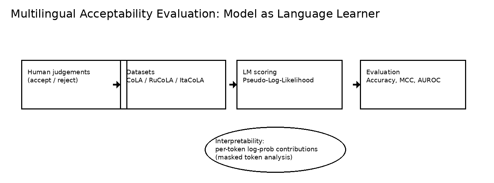
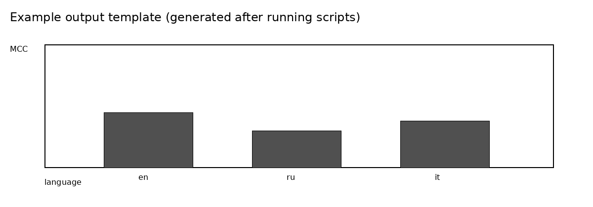

# Multilingual Acceptability Evaluation (CoLA / RuCoLA / ItaCoLA)

**One-liner:** A compact computational linguistics mini-project that evaluates whether multilingual language models assign higher likelihood to **human-acceptable** sentences across languages, with a lightweight interpretability layer.

<p align="center">
  
</p>

## Why this project (fit to lab vision)

This mini-project is built around a core research idea in computational linguistics:  
**language models can be studied as models of language learning**, and their behaviour can be tested against **human judgements**.

It demonstrates three skills that matter for PhD-level work:
1. **Evaluation design** (clear protocol, metrics, multilingual breakdown)
2. **Human–model comparison** (acceptability labels as behavioural signal)
3. **Interpretability** (token-level log-prob contributions via masked-token analysis)

---

## Concept

We score each sentence using **Pseudo-Log-Likelihood (PLL)** from a **masked language model** (default: `xlm-roberta-base`).  
For each token position *i*, we mask token *i* and compute log P(tokenᵢ | context). Summing across tokens gives a sentence-level score.

We then ask: does PLL separate **acceptable (1)** from **unacceptable (0)** sentences?

---

## Data

This repo supports two modes:

### A) Offline sample (included)
- `data/sample_acceptability.csv` (tiny multilingual dataset for instant runs)

### B) Multilingual suite via Hugging Face (recommended)
- **English CoLA** (GLUE task `cola`)
- **Russian RuCoLA**
- **Italian ItaCoLA**

You can extend the suite by adding more dataset specs in `src/data.py`.

---

## Quickstart

### 1) Install
```bash
pip install -r requirements.txt
```

### 2) Run on the included sample (fastest)
```bash
python scripts/run_sample.py --model xlm-roberta-base
```

### 3) Run the multilingual HF suite (downloads datasets once)
```bash
python scripts/run_hf_suite.py --model xlm-roberta-base --max_samples 200
```

Outputs:
- `outputs/metrics_by_language.csv`
- `outputs/figures/performance_by_language.png`

### 4) Interpretability example (token contributions)
```bash
python scripts/interpret_example.py --sentence "The cat sat on the mat."
```

Output:
- `outputs/token_contributions.txt`

---

## Results

After running `run_sample.py` or `run_hf_suite.py`, you will get:

- A CSV with **Accuracy / MCC / AUROC** per language  
- A plot showing MCC by language:

<p align="center">
  
</p>

> The figure above is a **template**. Your actual plot is generated under `outputs/figures/` after you run the experiment.

---

## Future scope (next phase)

- Improve scoring: length-normalised PLL, calibration, and confidence intervals.  
- Add **minimal-pair tests** (word order, agreement, morphology) to test linguistic hypotheses directly.  
- Compare multiple multilingual models (size vs generalisation trade-offs).  
- Extend to lower-resource languages and test robustness under domain shift.  
- Add human-inspired analyses: where do models and humans systematically disagree?

---

## Repo structure

```text
.
├── data/
├── docs/
├── scripts/
├── src/
└── outputs/            # created after running experiments
```

---

## License
MIT
